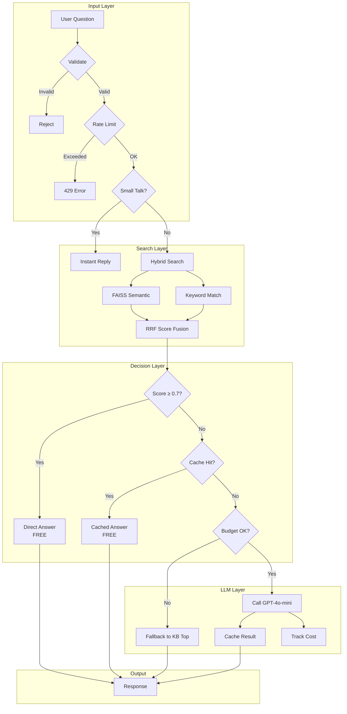

# FAQ Bot - Production-Ready Customer Service Chatbot

A cost-efficient, self-hosted FAQ chatbot that combines Knowledge Base search with LLM capabilities. Designed to reduce customer service costs by 90%+ compared to pure GPT solutions.

---

## Problem

**Customer service chatbots are expensive:**

| Approach | Cost per 1K queries | Issues |
|----------|---------------------|--------|
| Pure GPT-4o | ~$7.50 | Expensive, slow, hallucinations |
| Pure GPT-4o-mini | ~$0.45 | Still adds up, no control |
| Human agents | ~$50-100 | Not scalable |

**This solution:** ~$0.02-0.05 per 1K queries (90-99% cheaper)

### How?

1. **Layer 1: Knowledge Base** - Answer 70-80% of questions instantly from JSON (FREE)
2. **Layer 2: FAISS Semantic Search** - Find relevant answers even with different wording (~$0.00001/query)
3. **Layer 3: LLM** - Only for complex questions not in KB (~20-30% of traffic)
4. **Caching** - Same question = same answer, no API call

---

## Architecture



---

## Flow

```
1. User asks: "วิธีสมัครสมาชิก" (How to register)

2. Validate
   ├─ Length check (≤200 chars) ✓
   ├─ Emoji limit (≤3) ✓
   └─ XSS/injection check ✓

3. Rate Limit (Redis)
   ├─ IP: 20/min, 100/day
   ├─ Fingerprint: 40/min
   └─ Global: 200/min

4. Small Talk Check
   └─ "สวัสดี" → instant response (skip search)

5. Hybrid Search
   ├─ FAISS: semantic similarity (cached embedding)
   ├─ Keyword: fuzzy match
   └─ RRF Fusion: combine scores

6. Decision
   ├─ Score ≥ 0.7 → Return KB answer (FREE)
   ├─ Score < 0.7 + Cache Hit → Return cached LLM answer
   └─ Score < 0.7 + Cache Miss → Call LLM (if budget allows)

7. Response
   └─ "สมัครสมาชิกได้ที่หน้าเว็บไซต์..."
```

---

## Why Not Just GPT?

| Factor | Pure GPT | This Solution |
|--------|----------|---------------|
| **Cost** | $0.45/1K queries | $0.02-0.05/1K queries |
| **Latency** | 500-2000ms | 10-50ms (KB hit) |
| **Hallucination** | High risk | Controlled (KB-grounded) |
| **Customization** | Prompt only | Full KB control |
| **Offline** | No | Yes (KB layer) |
| **Predictable** | No | Yes (same Q = same A) |
| **Data Privacy** | All to OpenAI | Only unknowns to API |

### The Math

**Pure GPT-4o-mini:**
- Input: ~150 tokens × $0.15/1M = $0.0000225
- Output: ~100 tokens × $0.60/1M = $0.00006
- **Per query: ~$0.00008 = $0.08/1K queries**

**This solution (realistic traffic):**
- 70% KB direct hits: FREE
- 20% cached LLM: FREE
- 10% LLM calls: $0.00008
- **Per query: ~$0.000008 = $0.008/1K queries**

**Savings: 90%+**

---

## Cost Analysis: 1,000 Daily Active Users

### Assumptions
- Each user asks 5 questions/day = 5,000 queries/day
- 70% answered by KB (free)
- 20% answered by cache (free)
- 10% need LLM = 500 LLM calls/day

### Monthly Cost Breakdown

| Component | Calculation | Monthly Cost |
|-----------|-------------|--------------|
| **LLM (GPT-4o-mini)** | 500 calls × 30 days × $0.00008 | **$1.20** |
| **Embedding (FAISS)** | 5,000 queries × 30 × $0.000001 | **$0.15** |
| **Redis** | Self-hosted or ~$5/mo | **$5.00** |
| **Server** | VPS 2GB RAM | **$10-20** |
| **Total** | | **~$16-26/month** |

### Comparison

| Solution | 1K users/month |
|----------|----------------|
| Pure GPT-4o-mini | ~$120/month |
| Pure GPT-4o | ~$1,125/month |
| **This solution** | **~$20/month** |
| Human agents (1 person) | ~$1,500/month |

---

## Screenshots

### Status Page (`/api/status`)

```json
{
  "rate_limits": {
    "minute": {"used": 3, "max": 20},
    "day": {"used": 45, "max": 100}
  },
  "budget": {
    "today_cost_usd": 0.0234,
    "daily_budget_usd": 10.0,
    "remaining_usd": 9.9766,
    "exceeded": false
  },
  "cache": {
    "cached_answers": 127
  },
  "llm_available": true,
  "llm_enabled": true,
  "model": "gpt-4o-mini",
  "faiss": {
    "enabled": true,
    "ready": true,
    "vectors": 45
  },
  "search_weights": {
    "faiss": 0.7,
    "keyword": 0.3
  }
}
```

### Search Debug (`/api/search?q=สมัครสมาชิก`)

```json
{
  "query": "สมัครสมาชิก",
  "mode": "hybrid",
  "faiss_ready": true,
  "results": [
    {
      "q": "วิธีสมัครสมาชิก",
      "a": "สมัครสมาชิกได้ที่...",
      "score": 0.892,
      "faiss_score": 0.95,
      "keyword_score": 0.8,
      "exact": true
    }
  ]
}
```

---

## API Endpoints

| Endpoint | Method | Description |
|----------|--------|-------------|
| `/api/ask` | POST | Main chat endpoint |
| `/api/search` | GET | Debug search (hybrid/faiss/keyword) |
| `/api/status` | GET | System status, budget, cache stats |
| `/api/kb/reload` | GET | Reload knowledge base |
| `/api/faiss/rebuild` | POST | Rebuild FAISS index (background) |

### Example: `/api/ask`

**Request:**
```bash
curl -X POST http://localhost:8000/api/ask \
  -H "Content-Type: application/json" \
  -d '{"question": "ราคาสินค้า"}'
```

**Response:**
```json
{
  "answer": "ราคาสินค้าเริ่มต้นที่ 299 บาท...",
  "source": "ราคาสินค้าเท่าไหร่",
  "used_llm": false,
  "cached": false,
  "score": 0.85
}
```

---

## Use Cases

### 1. **E-commerce Customer Support**
- Product inquiries, shipping, returns
- Order status (integrate with order API)
- Payment methods

### 2. **SaaS Help Desk**
- Feature questions
- Pricing plans
- Technical troubleshooting

### 3. **HR/Internal FAQ**
- Leave policies
- Benefits information
- Onboarding questions

---

## Integration Examples

### Embed in Website

```html
<script>
async function askBot(question) {
  const res = await fetch('https://your-domain.com/api/ask', {
    method: 'POST',
    headers: {'Content-Type': 'application/json'},
    body: JSON.stringify({question})
  });
  return res.json();
}
</script>
```

### LINE Bot Integration

```python
@handler.add(MessageEvent, message=TextMessage)
def handle_message(event):
    question = event.message.text
    response = requests.post(
        'http://faqbot:8000/api/ask',
        json={'question': question}
    ).json()
    
    line_bot_api.reply_message(
        event.reply_token,
        TextSendMessage(text=response['answer'])
    )
```

### Slack Bot

```python
@app.event("message")
def handle_message(event, say):
    response = requests.post(
        'http://faqbot:8000/api/ask',
        json={'question': event['text']}
    ).json()
    say(response['answer'])
```

### Mobile App (Flutter)

```dart
Future<String> askBot(String question) async {
  final response = await http.post(
    Uri.parse('https://your-domain.com/api/ask'),
    headers: {'Content-Type': 'application/json'},
    body: jsonEncode({'question': question}),
  );
  return jsonDecode(response.body)['answer'];
}
```

---

## Quick Start

### 1. Clone and Configure

```bash
# Copy environment file
cp .env.example .env

# Edit configuration
nano .env
```

### 2. Add Your Knowledge Base

Edit `knowledge/knowledge.json`:

```json
{
  "company_info": {
    "name": "Your Company",
    "description": "Your description"
  },
  "qa": [
    {
      "q": "คำถามภาษาไทย",
      "q_en": "English question",
      "a": "คำตอบ",
      "a_en": "Answer",
      "keywords": ["keyword1", "keyword2"]
    }
  ]
}
```

### 3. Run with Docker

```bash
docker-compose up -d --build
```

### 4. Test

```bash
curl http://localhost:8000/api/status
curl -X POST http://localhost:8000/api/ask \
  -H "Content-Type: application/json" \
  -d '{"question": "test"}'
```

---

## Configuration

| Variable | Default | Description |
|----------|---------|-------------|
| `OPENAI_API_KEY` | - | Required for LLM |
| `MODEL` | gpt-4o-mini | LLM model |
| `REDIS_URL` | redis://localhost:6379/0 | Redis connection |
| `DAILY_BUDGET_USD` | 10.0 | Daily LLM spending limit |
| `RATE_LIMIT_PER_MINUTE` | 20 | Per-IP rate limit |
| `USE_FAISS` | true | Enable semantic search |
| `SIMILARITY_THRESHOLD` | 0.5 | Minimum score for KB match |

---

## File Structure

```
faqbot/
├── app.py              # FastAPI routes (359 lines)
├── config.py           # Configuration
├── models.py           # Pydantic schemas
├── constants.py        # Small talk responses
├── utils.py            # Helpers
├── lifecycle.py        # App initialization
├── services/
│   ├── knowledge.py    # Knowledge Base
│   ├── faiss_index.py  # FAISS + Hybrid Search
│   ├── llm.py          # OpenAI integration
│   ├── cache.py        # LLM caching
│   ├── rate_limit.py   # Rate limiting
│   └── budget.py       # Cost tracking
├── knowledge/
│   └── knowledge.json  # Your FAQ data
├── Dockerfile
├── docker-compose.yml
└── requirements.txt
```

---

## Safety Features

| Feature | Description |
|---------|-------------|
| **Rate Limiting** | IP + Fingerprint + Global limits |
| **Budget Control** | Daily USD limit, auto-fallback to KB |
| **Input Validation** | XSS, injection, length checks |
| **Hallucination Guard** | LLM instructed to say "I don't know" |
| **Fail Closed** | Redis down = block LLM (prevent cost runaway) |
| **No PII Logging** | Telemetry tracks tokens, not content |

---

## Incident Scenarios

### What happens if Redis is down?

| Component | Behavior | Impact |
|-----------|----------|--------|
| Rate Limiting | **FAIL CLOSED** - blocks all requests | Users get 503 |
| LLM Cache | **FAIL CLOSED** - skip cache | No cached answers |
| Embedding Cache | **FAIL CLOSED** - skip FAISS | No semantic search |
| FAISS Search | **DEGRADED** - returns empty | Fallback to keyword |
| Keyword Search | ✅ **WORKS** - no Redis needed | Still answers from KB |
| Budget Check | **FAIL CLOSED** - blocks LLM | No OpenAI charges |

**Result:** System degrades to keyword-only search. No runaway costs.

```
Redis Down → Embedding blocked → FAISS returns [] → Keyword search only → Still works (degraded)
```

---

### What happens if OpenAI is down?

| Component | Behavior | Impact |
|-----------|----------|--------|
| FAISS Search | ✅ **WORKS** | Semantic search OK |
| Keyword Search | ✅ **WORKS** | Exact match OK |
| LLM Summarize | ❌ **FAILS** | Returns KB top result |
| Free Chat | ❌ **FAILS** | Returns "no info found" |

**Result:** 70-80% of queries still work (KB hits). Only complex questions fail gracefully.

---

### What happens if FAISS index is corrupted?

| Component | Behavior | Impact |
|-----------|----------|--------|
| FAISS Load | **FAILS** - catches exception | Logs warning |
| Hybrid Search | **DEGRADED** - FAISS returns [] | Keyword only |
| System | ✅ **WORKS** | Full keyword search |

**Recovery:**
```bash
# Rebuild index
curl -X POST http://localhost:8000/api/faiss/rebuild

# Or delete and restart (auto-rebuilds)
rm /data/knowledge/faiss.index
docker-compose restart faqbot
```

---

### What happens if daily budget exceeded?

| Component | Behavior | Impact |
|-----------|----------|--------|
| KB Direct Hit | ✅ **WORKS** | Score ≥ 0.7 answers |
| LLM Cache Hit | ✅ **WORKS** | Cached answers |
| LLM New Call | ❌ **BLOCKED** | Returns KB top result |
| Free Chat | ❌ **BLOCKED** | Returns "no info found" |

**Result:** System auto-degrades to KB-only mode. No surprise bills.

---

### What happens under DDoS / high traffic?

| Layer | Protection | Limit |
|-------|------------|-------|
| IP Rate Limit | Per-IP throttle | 20/min, 100/day |
| Fingerprint | Browser fingerprint | 40/min |
| Global | All users combined | 200/min |

**Fail mode:** Returns 429 Too Many Requests. Legitimate users in queue still served.

---

### Monitoring Checklist

```bash
# Health check
curl http://localhost:8000/api/status

# Check these:
# ✓ faiss.ready = true
# ✓ llm_enabled = true  
# ✓ budget.exceeded = false
# ✓ cache.cached_answers > 0 (after warmup)
```

**Alerts to set up:**
- `budget.remaining_usd < 2.0` → Warning
- `budget.exceeded = true` → Critical
- `faiss.ready = false` → Warning
- `llm_available = false` → Critical

---

## Limitations

### ❌ Not Suitable For

| Use Case | Why | Alternative |
|----------|-----|-------------|
| **Open-domain chat** | No knowledge boundary, hallucination risk | Use ChatGPT directly |
| **Real-time data** | Stock prices, weather, live scores | Integrate external APIs |
| **Complex reasoning** | Multi-step logic, math proofs | Use GPT-4 / Claude |
| **Creative writing** | Stories, poems, marketing copy | Use dedicated LLM |
| **Code generation** | Programming assistance | Use Copilot / Cursor |

---

### ⚠️ Requires

| Requirement | Effort | Notes |
|-------------|--------|-------|
| **Curated Knowledge Base** | High initial | Must write Q&A pairs |
| **Regular KB updates** | Medium ongoing | New products, policy changes |
| **Keyword optimization** | Low | Add synonyms for better match |
| **Monitoring** | Low | Check budget, cache hit rate |

---

### 📊 Performance Boundaries

| Metric | Tested Limit | Notes |
|--------|--------------|-------|
| KB size | ~10,000 Q&A | Beyond this, consider Elasticsearch |
| Concurrent users | ~100 | Single instance, scale with replicas |
| Query latency (KB hit) | <50ms | 95th percentile |
| Query latency (LLM) | 500-2000ms | Depends on OpenAI |
| FAISS index build | ~1 min / 1000 items | One-time or background |

---

### 🔄 When to Upgrade

Consider upgrading when:

1. **KB > 10K items** → Add Elasticsearch / Meilisearch
2. **Need real-time data** → Add external API integrations
3. **Multi-turn conversation** → Add session memory
4. **Multiple languages at scale** → Add language detection + routing
5. **99.9% SLA required** → Add Redis cluster, multi-region

---
